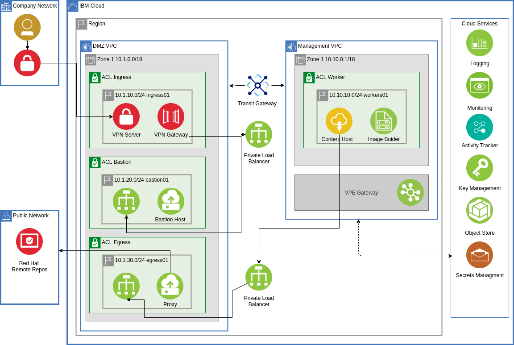

# ibm-cloud-edge-reference-architecture

A template for creating an [RHEL for Edge Service](https://access.redhat.com/documentation/en-us/red_hat_enterprise_linux/9/html/composing_installing_and_managing_rhel_for_edge_images/index) on [IBM Cloud](https://cloud.ibm.com)

## Change Log

- 11/2022 - Initial release

## Overview

This repository contains a set of terraform scripts based on the [IBM Cloud Reference architecture](https://github.com/IBM/ibm-cloud-reference-architectures) tailored specifically for running an [Red Het Enterprise Linux at the Edge](https://access.redhat.com/documentation/en-us/red_hat_enterprise_linux/9/html/composing_installing_and_managing_rhel_for_edge_images/index) instance in a secure environment that can be used as the basis of a compliance effort.

This README.md describes the SRE steps required to provision an environment that will scan cleanly with the Security and Compliance Centers NIST based profiles.

## Prerequisites

- Have access to an IBM Cloud Account, Enterprise account is best for workload isolation but if you only have a Pay Go account this set of terraform can be run in that level of account.
- Terraform 1.2.9 (1.3 is not supported as `Experiment "module_variable_optional_attrs" is no longer available.` and is a [breaking change](https://github.com/hashicorp/terraform/issues/31692))
- jq - [Install 1.6](https://stedolan.github.io/jq/download/) Other versions may work
- yq - [Install 4.28.2](https://github.com/mikefarah/yq#install) Other versions may work
- iascable - [Install 2.25.5](https://github.com/cloud-native-toolkit/iascable#installation) Earlier versions are not supported due to known issues.
- OpenVPN Client [Install](https://openvpn.net/vpn-client/) for your client device

## Assets Deployed

### 000 Account Setup

- API key creation
    Restricts the users that can create API keys based on the required access assigned. [Learn more](https://cloud.ibm.com/docs/account?topic=account-allow-api-create).

    Go to https://cloud.ibm.com/iam/settings to re-enable

- Service ID creation
    Restricts the users that can create service IDs based on the required access assigned. [Learn more](https://cloud.ibm.com/docs/account?topic=account-restrict-service-id-create)

    Go to https://cloud.ibm.com/iam/settings to re-enable

- Multifactor authentication (MFA)
    Enables MFA for all users providing an extra layer of security for all IBMid users by requiring an ID, password and a time-based one time passcode. Users without an IBMid are not affected by this setting.

    Go to https://cloud.ibm.com/iam/settings?tab=authentication to modify

### Shared services

- IBM Key Protect - For the highest level of security, you can also use a Hyper Protect Crypto Service instance
- IBM Log Analysis
- IBM Monitoring
- Activity Tracker
- Secrets Manager
- Object Storage

### DMZ network

- Client to Site VPN server or Site to Site VPN Gateway
- Bastion server(s)

### Management network

- RHEL for Edge Environment

## Reference Architecture




## Configuration

1. Generate the SSH keys

    ```
    ./create-ssh-keys.sh
    ```

1. Create a copy of the Terraform scripts in a workspace/current

    ```
    setup-workspace.sh
    ```

1. Change directory into the new folder

    ```
    cd ../workspaces/current
    ```

1. Edit the `terraform.tfvars` file with the values you require as sample is provided in `terraform.tfvars.sample`

1. Configure the terraform variable for your [IBM Cloud API key](https://cloud.ibm.com/iam/apikeys) by running the following in your shell.

    ```
    export TF_VAR_ibmcloud_api_key=xxx
    ```

## Install

1. If you are testing this out on a personal account you may wish to skip the `000-ibm-edge-account-setup` as this will prevent service ids being generated which can impact some expected functionality.

    If that is the case then run the 100 to 120 configurations in workspaces/current seperately:
    e.g.
    ```
    cd 100-ibm-edge-shared-services
    terraform init
    terraform apply -auto-approve
    ```